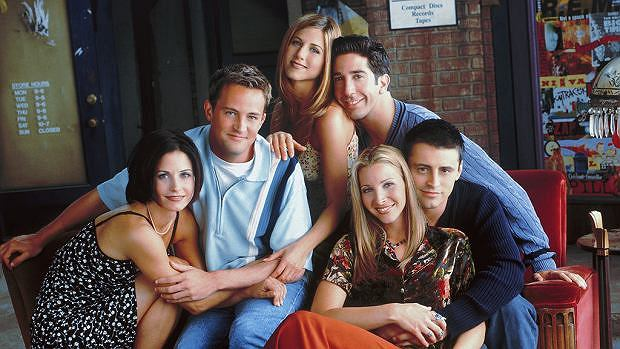

# About the show 

Friends is an American television sitcom created by *David Crane* and *Marta Kauffman*, which aired on NBC from September 22, 1994, to May 6, 2004, lasting ten seasons. With an ensemble cast starring *Jennifer Aniston*, *Courteney Cox*, *Lisa Kudrow*, *Matt LeBlanc*, *Matthew Perry*, and *David Schwimmer*, the show revolves around six friends in their 20s and early 30s who live in Manhattan, New York City.

*source: Wikipedia*


# Image

Image of the cast from first season:



# Summary of viewership and rating

Below presented summary of viewership and ratings of each season. The table generation was fasten up by Chat GPT and the colors to second graph were added with help of chat. 

```{r libraries, include=FALSE}
library(dplyr)
library(tibble)
library(ggplot2)

```

```{r stats}

friends_stats <- tibble(
  season = 1:10,
  rating = c(15.6, 18.7, 16.8, 16.1, 15.7, 14.0, 12.6, 15.0, 13.5, 13.6),
  viewers_millions = c(24.8, 31.7, 26.1, 25.0, 24.7, 23.0, 22.1, 26.7, 23.9, 26.1)
)

friends_stats

```

### Graph of the viewership over time 

```{r viewers over time}

ggplot(friends_stats, aes(x = season, y = viewers_millions)) +
  geom_line(linewidth = 1, color="#440154") +
  geom_point(size = 2, color="#440154") +
  labs(
    title = "Viewership of Friends Over Time",
    x = "Season",
    y = "Viewers (millions)"
  ) +
  theme_minimal()

```

### Graph of the season-to-season changes in viewership

```{r, changes plot}

friends_changes <- friends_stats %>% mutate(change = viewers_millions - lag(viewers_millions)) %>% filter(!is.na(change))

ggplot(friends_changes, aes(x = season, y = change, fill = change > 0)) +
  geom_col() +
  scale_fill_manual(values = c("TRUE" = "lightgreen", "FALSE" = "#d7191c")) +
  labs(
    title = "Season-to-Season Changes in Viewership",
    x = "Season",
    y = "Change in viewers (millions)",
    fill = "Increase"
  ) +
  theme_minimal()
```

The largest increase in viewership occurred between seasons 1 and 2 it was close to: **`r round(friends_changes$change[1], 1)`** million viewers. Another visible peak is observed between season 7 and 8, it was equal to: **`r round(friends_changes$change[7], 1)`** million viewers. Beside peaks the show mostly experienced declines, with the biggest drop between second and third season.

However this views taking into consideration only viewers in front of the TV while the episodes were aired, the actual streaming numbers via HBO or Netflix are much higher. 

----

Sources: 

- Wikipedia 
- ChatGPT was used to debbuging and elevating output
- https://stackoverflow.com/questions/10902504/r-markdown-accessing-variable-from-code-chunk-variable-scope - to learn how to insert variable into text